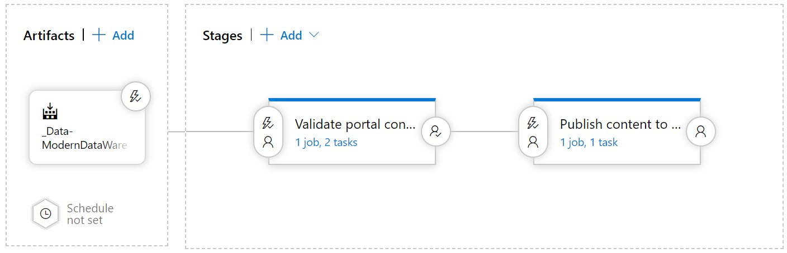

# <a name="mdw-openhack-content-repo"></a>MDW OpenHack コンテンツ リポジトリ

こんにちは。 最新のデータ ウェアハウス OpenHack コラボレーション リポジトリへようこそ。
ここでは、このイベントを実行するためのコンテンツとサポート リソースをビルドするすべてのリソースを紹介します。 詳細とリンクについては、以下の項目を参照してください。

# <a name="repo-structure"></a>リポジトリの構造
* **ポータル** (英語バリアント)
    * **en**
        * OpenHack ポータルでの課題に対するマークダウン ファイル
        * Opsgility ポータルのラボ構造を定義する JSON ファイル
* **resources**
    * コーチ ガイド
    * コーチと参加者のトピック デッキ
    * 1-pager
    * コーチと OpenHack 利害関係者向けのその他のリソース
    * **ソリューション**
        * 課題の検証済みソリューション コード

## <a name="deployment-pipeline"></a>デプロイ パイプライン

このコンテンツの配置パイプラインは、次のように機能します。



### <a name="artifact"></a>アーティファクト

ビルド成果物は、[このビルド パイプライン](https://dev.azure.com/cseeest/OpenHack/_build?definitionId=9)によって生成される結果であり、2 つのフォルダーからなる構造を生成します。1 つはコーチ ガイド用、もう 1 つは Opsgility ポータルに対するものです。

### <a name="stage-1---validate-portal-content"></a>ステージ 1 - ポータル コンテンツの検証

Opsgility に発行される前に、すべてのコンテンツがここで最初に公開されます。

[https://openhack-validation-env.azurewebsites.net/](https://openhack-validation-env.azurewebsites.net/)

「コーチ ガイド」のファイルを Word ドキュメント形式で指定します。

### <a name="stage-2---publish-content-to-azure-blob"></a>ステージ 2 - Azure Blob へのコンテンツの発行

ここでは、コンテンツが *運用* に発行されます。 この BLOB にコンテンツをデプロイすると、このバージョンで新しい教室を作成できるようになります。

## <a name="source-code-structure"></a>ソース コードの構造

[](https://dev.azure.com/cseeest/OpenHack/_build/latest?definitionId=9&branchName=master)

### <a name="portal"></a>ポータル

```bash
portal
    /en
```

この `portal` には、Opsgility ポータルに発行されるコンテンツが保存されます。 複数のコンテンツ言語を追加できます。 上記の例では、`en` フォルダーは英語のコンテンツです。 たとえば、スペイン語のコンテンツを発行する場合は、`portal/es` フォルダーの下にスペイン語版のコンテンツを配置します。

```bash
resources
    /CoachesGuide
        /content
        Coaches-Guide-Template.docx
```

### <a name="resources"></a>リソース

#### <a name="coaches-guide"></a>コーチ ガイド

ポータル以外のすべてのコンテンツ ファイルと参照は、`resources` に保存されます。
コーチ ガイドのコンテンツは、Azure DevOps ポータルから読み取ることができ、さまざまなファイル形式にエクスポートできるため、Markdown としても保存されます。

現在、`CI-pipeline.yaml` には Word ドキュメントにエクスポートするプロセスがすでに存在します。 `Coaches-Guide-Template.docx` は、ヘッダーと既定のスタイルを使用してドキュメントを生成するために使用されるテンプレートです。

#### <a name="etl-ddl"></a>ETL-DDL

```bash
resources
    /ETL-DDL
        /Ingest
        /Normalize
```

Databricks ワークスペースにインポートできるノートブックのコレクション。
これらのノートブックは、抽出されたデータにスキーマを適用し、中間データセットを作成する目的ですべてのソース システムからのデータを準拠させます。

### <a name="one-pager"></a>1 ページャー

```bash
resources
    /one-pager
        MDWOp1pg.docx
```

フォルダーに `one-pager` は 1 つのファイル `MDWOp1pg.docx` が含まれています。これは、OpenHack、そのコンテキスト、チャレンジ構造体、および関連テクノロジーについて説明する 1 ページャーのドキュメントです。

### <a name="data-catalog"></a>Data Catalog

```bash
resources
    /DataCatalog
        *.csv
        DataCatalog.xlsx
```

すべてのソース システムとターゲットに準拠したスキーマの **例** データ カタログ。 `.csv` ファイルは、`.xlsx` ファイルを開くことができるアプリケーションを持っていないユーザーをサポートする目的でのみ存在します。 各 CSV は、XLSX ブックの 1 つのシートを表します。

### <a name="tooling"></a>ツール

```bash
tooling
    /address-generation
    /Databases
    /Deployment
    /Utility
```

#### <a name="address-generation"></a>アドレスの生成

これは、ランダムなアドレスを生成するために `address-generation` の下に格納されているノード アプリケーションです。 これは、クラスルーム環境のプロビジョニングに使用されている現在のアドレス データベースのバックアップを変更する必要がない限り、変更する必要はありません。

#### <a name="databases"></a>データベース

これらは、ソース スキーマとターゲット スター スキーマを作成およびデプロイするためのデータベース プロジェクトです。

#### <a name="deployment"></a>デプロイ

`Deployment` フォルダーには、クラスルームに 1 つまたは複数の環境をデプロイするために使用されるすべてのファイルが保持されます。 この一連のスクリプトの詳細については、こちらの [README](./tooling/Deployment/README.md) を参照してください。

### <a name="markdown-lint-file"></a>Markdown lint ファイル

[markdownlint VS Code 拡張機能](https://marketplace.visualstudio.com/items?itemName=DavidAnson.vscode-markdownlint)を使用する場合、`.markdownlin.json` は、Azure DevOps CI ビルド パイプライン (`CI-pipeline.yaml`) または Visual Studio Code のいずれかで使用される lint 構成ファイルです。

### <a name="ci-build-pipeline-definition-file"></a>CI ビルド パイプライン定義ファイル

`CI-pipeline.yaml` ファイルには、OpenHack コンテンツで CI ビルドを実行するためのすべての構成が保存されます。 このビルドは現在、PR ビルドおよびマスター以外の分岐の CI のいずれかで使用されています。
