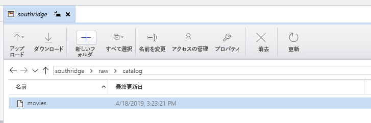

## 課題 1: 実話に基づいている

最初の課題は、エンタープライズ データ レイクを確立するように設計されています。
この課題の目標は、チームがストレージを選択してプロビジョニングする方法です。
推奨される解決策は、階層型名前空間が有効になっている Azure Storage アカウント、つまり [ADLS Gen2](https://docs.microsoft.com/ja-jp/azure/storage/blobs/data-lake-storage-introduction) をプロビジョニングすることです。

> Azure Data Lake Storage Gen2 は、ビッグ データ分析専用の機能セットであり、Azure Blob Storage に基づいて構築されています。
Data Lake Storage Gen2 は、Azure Blob ストレージと Azure Data Lake Storage Gen1 という、既存の 2 つのストレージ サービスの機能を集約したものです。
ファイル システム セマンティクス、ディレクトリ、ファイル レベルのセキュリティおよびスケーリングなど、Azure Data Lake Storage Gen1 に由来する機能が、Azure Blob ストレージの低コストの階層型記憶域、高可用性/ディザスター リカバリー機能と組み合わされています。

### ADLS Gen 2 ストレージ アカウントの作成

[Azure Data Lake Storage Gen2 ストレージ アカウントを作成するための製品ドキュメントのクイックスタート](https://docs.microsoft.com/ja-jp/azure/storage/blobs/data-lake-storage-quickstart-create-account)には、Azure portal、PowerShell、または Azure CLI を介してストレージ アカウントを作成するためのすべての詳細が含まれています。

ストレージ アカウントの種類が StorageV2 であり、階層型名前空間が有効になっていることを確認してください。

### 任意のファイルの格納

これを実現する 1 つの方法は、[Azure Storage Explorer](https://azure.microsoft.com/ja-jp/features/storage-explorer/) を使用することです。
ファイルはアップロードおよびダウンロードでき、「アクセスの管理」機能ではファイルの ACL の指定がサポートされます。

