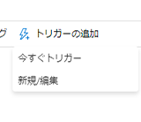

## <a name="challenge-2-lights-camera-action"></a>課題 2: ライト、カメラ、アクション

2 つ目の課題は、Azure SQL データベースと Cosmos DB コレクションから初期の Southridge データを抽出することです。
この課題の目標は、データ移動ソリューションを使用してチームを稼働させることです。 推奨される解決方法は、[Azure Data Factory](https://docs.microsoft.com/en-us/azure/data-factory/) を使ってソース システムからデータ レイクにデータを **そのまま** コピーすることです。つまり、**最小限の変換、クレンジング、または処理** を行います。

> 注: この課題でも、エンタープライズ データ レイクにデータを一元化することの利点が既に確認でき始めています。
この課題のデータはすべて Azure 内にありますが、Azure SQL のリレーショナル データと、Cosmos DB ドキュメント コレクションに JSON として格納されている非リレーショナル データが混在しています。

### <a name="creating-an-azure-data-factory"></a>Azure データ ファクトリの作成

[製品ドキュメント](https://docs.microsoft.com/en-us/azure/data-factory/)の[クイックスタート](https://docs.microsoft.com/en-us/azure/data-factory/#5-minute-quickstarts)には、[Azure portal](https://docs.microsoft.com/en-us/azure/data-factory/quickstart-create-data-factory-portal#create-a-data-factory) または [PowerShell](https://docs.microsoft.com/en-us/azure/data-factory/quickstart-create-data-factory-powershell#create-a-data-factory) を使用した Azure Data Factory リソースの作成に関する詳細がすべて記載されています。

> 注: 上でリンクされているクイックスタートには、データ ファクトリ内にパイプラインを作成するための追加情報が記載されています。 OpenHack ソリューションのこのセクションの範囲では、クイックスタートの「データ ファクトリの作成」セクションのみを参照してください。

### <a name="extracting-the-sales-streaming-and-catalog-data-into-the-data-lake"></a>売上データ、ストリーミング データ、カタログ データをデータ レイクに抽出する

必要な手順は、大まかに次のようになります

1. Azure SQL データベース用のリンク サービスとソース データセットを定義する
1. Cosmos DB コレクション用のリンク サービスとソース データセットを定義する
1. ADLS Gen 2 ストレージ アカウント用のリンク サービスとシンク データセットを定義する
1. ソースからシンクにデータをコピーするパイプラインを作成する

#### <a name="defining-the-cosmos-db-linked-service-and-source-dataset"></a>Cosmos DB のリンク サービスとソース データセットの定義

Data Factory の作成エクスペリエンスから、新しいデータセットを追加します。


Azure Cosmos DB (SQL API) データ ストアを選択してから、続行します。


データセットのプロパティ ウィンドウの [接続] タブから、[新規] をクリックして新しいリンク サービスを作成します。


最も簡単な方法は、表示されたドロップダウンから Cosmos DB アカウントとデータベースを選択し、[完了] をクリックすることです。


ムービーのコレクションを選択します。 データをプレビューしたり、[スキーマ] タブでスキーマをインポートしたりする **必要はありません**。これらの要素を無視し、代わりにカタログ データをデータ レイクに **そのまま** 取り込む方が、ソリューションは簡単になります。


必要に応じて、この時点で検証と発行を行い、進行状況の "チェックポイント" を作成することもできますが、データセットはまだどこでも使用されていないことに注意してください。

#### <a name="defining-the-azure-sql-linked-services-and-source-datasets"></a>Azure SQL のリンク サービスとソース データセットの定義

Data Factory の作成エクスペリエンスから、新しいデータセットを追加します。


[Azure SQL Database] を選択してから、[続行] をクリックします。


[接続] タブで、[新規] をクリックして、新しいリンク サービスを作成します。
最も簡単な方法は、ドロップダウンを使ってターゲットの Azure リソースを選択することです。 認証資格情報も指定して、[完了] をクリックします。


テーブル名をハードコーディングするのではなく、再利用できるようにパラメーター化する方が便利です。 [パラメーター] タブにアクセスし、[新規] をクリックしてテーブル名パラメーターを追加します。


次に、そのパラメーターを使って、[接続] タブで動的なコンテンツを追加できます。

> 注: このスクリーンショットには [動的なコンテンツの追加] オプションの場所とスタイルが示されていますが、それはファイル パスとの関連におけるものです。 同じ概念は、Azure SQL データセット接続の "Table" プロパティにも当てはまります。
また、"Table" プロパティの下にある [編集] ボタンをクリックして、ドロップダウンをテキスト ボックスに変えていない限り、[動的なコンテンツの追加] オプションが表示されない場合があることにも注意してください。


> 注: このプロセスを繰り返して、他の Southridge Azure SQL データベースのデータセットを定義します。 論理サーバー内の 2 つのデータベースは、CloudSales と CloudStreaming です。

その後、必要に応じて、進行状況の "チェックポイント" としてすべてを検証し、発行することもできます。

#### <a name="defining-the-adls-gen-2-linked-service-and-sink-datasets"></a>ADLS Gen 2 のリンク サービスとシンク データセットの定義

Data Factory の作成エクスペリエンスから、新しいデータセットを追加します。


[Azure Data Lake Storage Gen2] を選択し、[続行] をクリックします。


[接続] タブで、[新規] をクリックして、新しいリンク サービスを作成します。
最も簡単な方法は、ドロップダウンを使ってターゲットの Azure リソースを選択することです。 次に、[完了] をクリックします。


このデータセットを再利用しやすくするために、[パラメーター] タブに移動し、`directory` パラメーターと `file` パラメーターを定義します。 これらは、次のステップで使用します。


[接続] タブに戻り、これらのパラメーターを出力ファイルのパスとして使用するために、ディレクトリとして `@dataset().directory` を指定し、ファイルとして `@dataset().file` を指定します。

> 注: これらのパラメーター化された値を指定するには、[動的なコンテンツの追加] 機能を使う必要があります。


プロパティ ウィンドウの [接続] タブで、"JSON 形式" を "オブジェクトのセット" パターンと共に使用するように選択します。
データを格納するとき、出力ファイルの各行は、ソース データセットからの 1 つの JSON オブジェクトになります。
これは、出力ファイル自体ではなく、ファイルの各行が有効な JSON になるという意味であることに注意してください。


必要に応じて、この時点で検証と発行を行い、進行状況の "チェックポイント" を作成することもできますが、データセットはまだどこでも使用されていないことに注意してください。

> 注: このプロセスを繰り返しますが、JSON ファイル形式を選択する代わりに、テキスト (CSV) または parquet 形式を選択してください。
その後、2 つの ADLS Gen2 データセットが使用できるようになります。1 つは JSON オブジェクトのセットとしてデータを格納し、もう 1 つはテキスト (CSV) または parquet 形式で格納します。

#### <a name="creating-a-pipeline-to-copy-the-cosmos-db-movies-collection"></a>Cosmos DB のムービー コレクションをコピーするパイプラインの作成

Data Factory の作成エクスペリエンスから、新しいパイプラインを追加します。


"Copy Data" タスクをデザイン サーフェイス上にドラッグします。


[ソース] タブで、前の手順で作成した Cosmos DB データセットを選択します。


[ソース] タブで、前の手順で作成した ADLS Gen2 **JSON** データセットを選択します。
そのデータセットで定義されているパラメーターが、シンク データセットのプロパティで使用できるようになっていることがわかります。
出力ディレクトリとファイル名を指定します。


パイプラインを発行し、トリガーします。




ターゲットの場所にあるデータ レイクにデータが存在することを確認します。
確認する方法の 1 つは、[Azure Storage Explorer](https://azure.microsoft.com/en-us/features/storage-explorer/) を使うことです。


このファイルには、1047 個のムービー オブジェクトが含まれているはずです。最初の 3 つは次のようになります。

```json
{"actors":[{"name":"Eric Ray"},{"name":"Danielle Busey"},{"name":"Priscilla Wayne"}],"availabilityDate":"2017-03-14 00:00:00","genre":"Science Fiction","rating":"PG-13","releaseYear":1935,"runtime":162,"streamingAvailabilityDate":"2017-06-06 00:00:00","tier":1,"title":"Happy Theater","id":"9248bacc-4d5c-4758-a250-4002bd645482","_rid":"G4YpAJvRCE8BAAAAAAAAAA==","_self":"dbs/G4YpAA==/colls/G4YpAJvRCE8=/docs/G4YpAJvRCE8BAAAAAAAAAA==/","_etag":"\"00003c07-0000-0100-0000-5cb7b3720000\"","_attachments":"attachments/","_ts":1555542898}
{"actors":[{"name":"Jack Smith"},{"name":"Freida Pine"}],"availabilityDate":"2017-01-31 00:00:00","genre":"Romance","rating":"R","releaseYear":1965,"runtime":100,"streamingAvailabilityDate":"2017-03-28 00:00:00","tier":2,"title":"The Theater of Adventure","id":"10adb54b-ac9c-4a8b-a921-f9bd8ecb3988","_rid":"G4YpAJvRCE8CAAAAAAAAAA==","_self":"dbs/G4YpAA==/colls/G4YpAJvRCE8=/docs/G4YpAJvRCE8CAAAAAAAAAA==/","_etag":"\"00003d07-0000-0100-0000-5cb7b3720000\"","_attachments":"attachments/","_ts":1555542898}
{"actors":[{"name":"Thomas Carter"},{"name":"Eric Smith"}],"availabilityDate":"2018-05-22 00:00:00","genre":"Action/Adventure","rating":"R","releaseYear":1921,"runtime":143,"streamingAvailabilityDate":"2018-07-17 00:00:00","tier":2,"title":"The Book of Intrigue","id":"ee607719-e868-4d21-bead-54d796d8fec0","_rid":"G4YpAJvRCE8DAAAAAAAAAA==","_self":"dbs/G4YpAA==/colls/G4YpAJvRCE8=/docs/G4YpAJvRCE8DAAAAAAAAAA==/","_etag":"\"00003e07-0000-0100-0000-5cb7b3720000\"","_attachments":"attachments/","_ts":1555542898}
```

> 注: コンテンツを "そのまま" 取り込むことにより、_rid、_self、_etag、_attachments、_ts などの不要なメタデータが非常に多く含まれています。
大規模なデータセットを使用する運用シナリオでは、このデータをレイクに取り込むというトレードオフを考慮することが重要です。
OpenHack の範囲とこのムービー カタログのサイズとスケールに対しては、アクター配列の処理における摩擦を減らすために、この方法をお勧めします。

#### <a name="creating-a-pipeline-to-extract-azure-sql-data"></a>Azure SQL データを抽出するパイプラインの作成

Data Factory の作成エクスペリエンスから、新しいパイプラインを追加します。

 ' デザイン サーフェイス上に "ForEach" タスクをドラッグします。


空のパイプライン キャンバスを選択した状態で、[パラメーター] タブに `items` というパラメーターを追加します。このパラメーターの値はまだ重要ではありませんが、これによって ForEach タスクで反復処理を行う対象を定義するステージが設定されます。


ForEach タスクを選択した状態で、[パラメーター] タブで `items` パラメーターを定義します。上で定義したパイプライン パラメーターを使用するには、値を `@pipeline().parameters.items` に設定します。


[アクティビティ] タブで [アクティビティを編集] をクリックして、ForEach タスクの内部デザイン サーフェイスを開きます。


"Copy Data" タスクをデザイン サーフェイス上にドラッグします。


ソースを構成し、前に作成した CloudSales データセットを使うようにします。


> 注: データセットのテーブル名は、`@item().source.tableName` の動的コンテンツに設定されます。
チュートリアルのこの時点で、項目のこの `source` プロパティは、ForEach タスクの items コレクションでまだ定義または指定されていません。
これは、後の手順で定義します。

同様に、シンクを構成して、前に定義したテキスト (CSV) または parquet シンク データセットを使うようにします。


> 注: データセットのファイルとディレクトリは、`@item().destination` の動的コンテンツに設定されます。
チュートリアルのこの時点で、項目のこの `destination` プロパティは、ForEach タスクの items コレクションでまだ定義または指定されていません。
ここで、これと `@item().source` を設定します。

パイプラインのデザイン サーフェイスにアクセスして [パラメーター] タブに再び移動します。ここには値が指定されていない `items` プロパティがあります。
値は JSON 配列になります。配列内の各オブジェクトは、ForEach によって処理される項目です。
各オブジェクトの構造はユーザー定義です。
Copy Data タスクにおいて、このチュートリアルでは、各項目に `source` と `destination` が含まれること、また `source` には `tableName` が、一方 `destination` には `directory` と `file` の両方が含まれることを想定しています。

CloudSales データベースに対して機能する JSON `items` コレクションを次に示します。
読みやすくするために書式設定されています。

> 注: 以下では実装されていませんが、各項目のコピー先ディレクトリは簡単に変更できます。
この方法により、ACL が追加されたディレクトリに顧客と住所のデータを格納し、顧客データにアクセスするビジネス上のニーズがあるユーザーに制限できます。

```json
[
    {
        "source": {
            "tableName": "[dbo].[Addresses]"
        },
        "destination": {
            "directory": "southridge/raw/cloudsales",
            "file": "dbo.Addresses.parquet"
        }
    },
    {
        "source": {
            "tableName": "[dbo].[Customers]"
        },
        "destination": {
            "directory": "southridge/raw/cloudsales",
            "file": "dbo.Customers.parquet"
        }
    },
    {
        "source": {
            "tableName": "[dbo].[OrderDetails]"
        },
        "destination": {
            "directory": "southridge/raw/cloudsales",
            "file": "dbo.OrderDetails.parquet"
        }
    },
    {
        "source": {
            "tableName": "[dbo].[Orders]"
        },
        "destination": {
            "directory": "southridge/raw/cloudsales",
            "file": "dbo.Orders.parquet"
        }
    }
]
```

パイプラインを発行し、トリガーします。


ターゲットの場所にあるデータ レイクにデータが存在することを確認します。
確認する方法の 1 つは、[Azure Storage Explorer](https://azure.microsoft.com/en-us/features/storage-explorer/) を使うことです。


> 注: このプロセスを繰り返して、CloudStreaming データベースからデータを抽出します。
Azure Data Factory では "クローン" 機能がサポートされている点に注意してください。
"クローン" を使用した後は、ソース データセットと `items` コレクション内の詳細を調整するだけで済みます。

#### <a name="using-the-copy-data-wizard-to-copy-the-azure-sql-data"></a>Copy Data ウィザードを使って Azure SQL データをコピーする

> 注: Copy Data ウィザードの使用は優れたクイックスタート エクスペリエンスですが、ForEach 反復処理の使い方や、パイプラインを通じてパラメーターを定義して渡す方法など、一部の学習の詳細が取り除かれます。また、抽象的な名前のデータセットも生成されます。 これらの理由から、Copy Data ウィザードは 1 回だけ使用し、同様のパイプラインを一から作成するためのガイドとしてその結果を使うことをお勧めします。

Data Factory の作成エクスペリエンスから、Copy Data ウィザードを選択します。


ソース データセットを指定します。


`dbo` スキーマからテーブルを選択します。


ADLS Gen2 のコピー先を選択します。


出力フォルダーを指定し、必要に応じてファイル名を編集します。

> 注: ファイル名から `[` 文字と `]` 文字を削除することをお勧めします。


出力形式を選択します。 テキスト (CSV) または Parquet をお勧めします。


既定の設定を受け入れ、ウィザードを完了します。 パイプラインはすぐに実行され、データ レイクで出力ファイルを見つけることができます。


