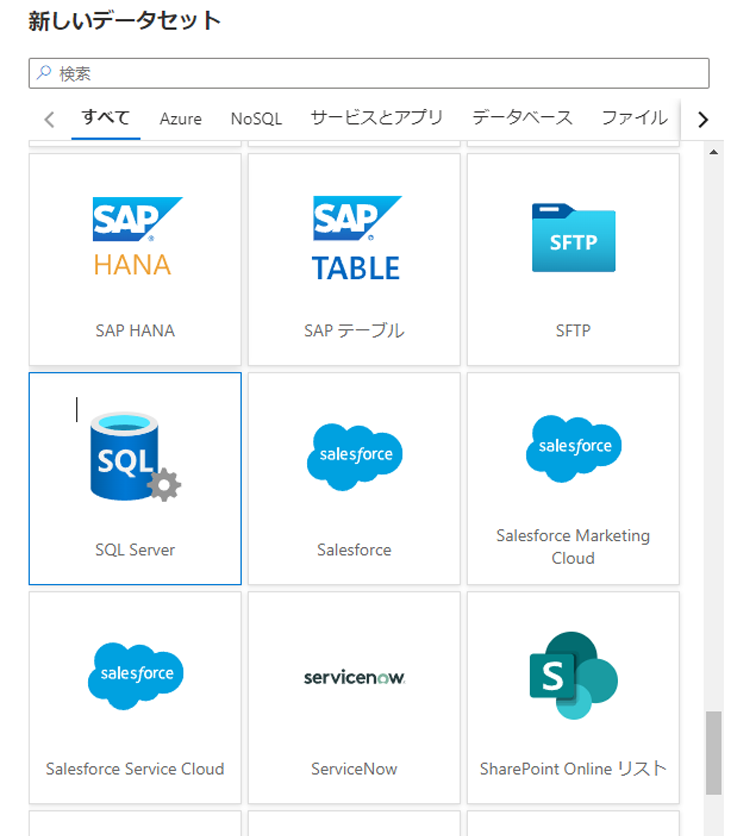
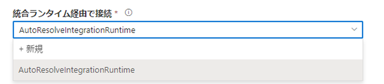
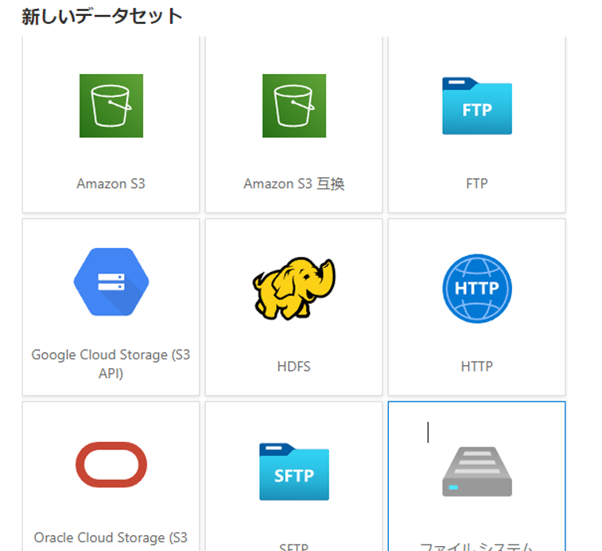
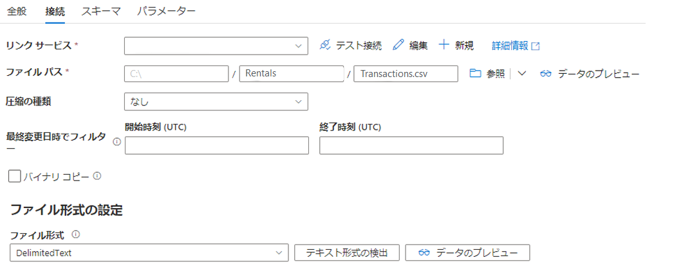
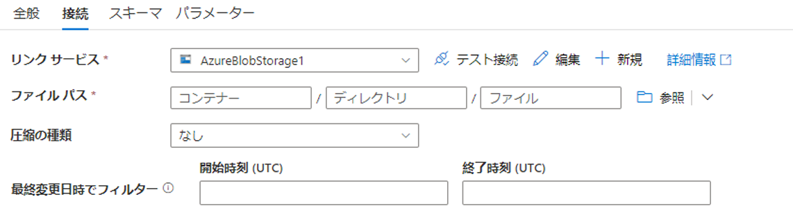

## <a name="challenge-3-breaking-the-fourth-wall"></a>課題 3: 第 4 の壁の突破

この課題では、追加のデータ ソースをデータ レイクに組み込むことに焦点を絞ります。 初期データはクラウド ベースのソースから抽出されましたが、この課題のデータは、オンプレミスのデータ ストアから来ています。

この課題を通して、これらのソースでは、さまざまなデータ型や形式が使用されていることが明確になる可能性があります。これを処理することは次の課題です。
今のところは、データを **できればそのまま** データ レイクに抽出することに引き続き焦点を絞ります。

> 注: OpenHack ラボ環境を確立するために、これらの "オンプレミス" のソースは Azure VM としてモデル化されています。 疑念をいったん棚上げして、これらの VM が、それぞれ対応する取得された架空の会社 (VanArsdel, Ltd. と Fourth Coffee) がある、実際に配置されているオンプレミスであると想像してみてください。

### <a name="extracting-vanarsdel-ltd-sql-data"></a>VanArsdel, Ltd. の SQL データの抽出

このプロセスは、Southridge Video の CloudStreaming データベースからデータを抽出するために実行された作業とほぼ同じです。
主な違いは、SQL Server インスタンスが Azure SQL 内ではなく、"オンプレミス" (このラボの制約から、Azure 仮想マシン上) にあることです。

Azure Data Factory では、[セルフホステッド統合ランタイム](https://docs.microsoft.com/ja-jp/azure/data-factory/create-self-hosted-integration-runtime#installation-best-practices)のインストールを通したオンプレミスのソースの抽出がサポートされています。

まず、SQL Server データセットを追加します。



[接続] タブから新しいリンク サービスを作成するときは、新しい統合ランタイムを作成することを選択します。



プロンプトに従って、新しいセルフホステッド IR を作成します。
これには、ランタイムのインストールと、そのインストールが完了した後の認証キーによる登録が含まれます。

[Parquet 形式](https://docs.microsoft.com/ja-jp/azure/data-factory/supported-file-formats-and-compression-codecs#parquet-format)を使用している場合は、IR マシンに 64 ビット JRE 8 (Java Runtime Environment) または OpenJDK をインストールすることも必要になります。

> 注: 運用環境シナリオでは、セルフホステッド IR をデータベース サーバー自体にインストールしないでください。
それを行うと、セキュリティやパフォーマンスに影響を与えます。
代わりに、ジャンプ ボックスが使用されます。
OpenHack のスコープでは、提供された "オンプレミス" VM にセルフホステッド IR をインストールすることが許容されます。

ランタイムとリンク サービスが確立された後、データセットとパイプラインの作成の残りの作業は Azure SQL データベースの場合とまったく同じです。
CloudStreaming データをコピーしたパイプラインを複製したら、ソースと `items` コレクションを変更するだけで済みます。

### <a name="copying-the-fourth-coffee-csv-data"></a>Fourth Coffee の CSV データのコピー

これも、同じように実行されます。
違いは、ファイル システム データセットが作成されることです。



ディレクトリ名やファイル名を (ADLS Gen2 シンクで実行されるように) パラメーター化することをお勧めしますが、一時的に 1 つのファイルを指定すると "テキスト形式の検出" 機能が有効になることに注意してください。





あるいは、[バイナリ コピー] チェックボックスをオンにします。
次に、既存の ADLS Gen2 リンク サービスを使用して別の ADLS Gen2 データセットを作成しますが、ここでも [バイナリ コピー] を選択します。
次に、これらをソースとシンクとして使用して、CSV ファイルをそのまま正確にコピーします。

> TODO: ソースと `items` を複製および更新してから発行しようとすると、テーブルのコピー アクティビティにはソースの種類が必要であるというエラーが発生します。 次を使用して `typeProperties` を更新するようにコード ビューを編集する必要がありました。

```json
"source": {
    "type": "FileSystemSource",
    "recursive": true
},
```

### <a name="establishing-source-control"></a>ソース管理の確立

Azure Data Factory では、Git 統合がサポートされています。
別のオプションとして、Azure Data Factory から ARM テンプレートをより手動でエクスポートしてコミットする方法があります。
