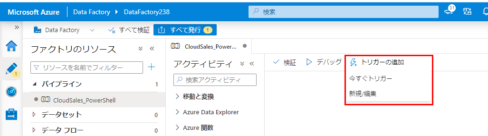

# <a name="creating-pipelines-to-orchestrate-the-data-movement"></a>データ移動を調整するパイプラインの作成

これでデータセットが適切に構成されたので、ソースからシンクにデータを移動するためにそれらを使用するパイプラインを作成できます。

## <a name="01---create-the-pipeline-to-move-the-cloudsales-sql-database"></a>01 - CloudSales SQL データベースを移動するパイプラインを作成する

[このリファレンス](https://docs.microsoft.com/en-us/azure/data-factory/quickstart-create-data-factory-powershell#create-a-pipeline)を使用し、PowerShell を使ってパイプラインを作成します。

以下の構造の、`CloudSales-Pipeline.json` という名前の新しいファイルを作成します。

```json
{
    "name": "<pipeline name>",
    "properties": {
        "activities": [
            {
                "name": "ForEach_Table",
                "type": "ForEach",
                "typeProperties": {
                    "items": {
                        "value": "@pipeline().parameters.items",
                        "type": "Expression"
                    },
                    "activities": [
                        {
                            "name": "Copy_Rows",
                            "type": "Copy",
                            "policy": {
                                "timeout": "7.00:00:00",
                                "retry": 0,
                                "retryIntervalInSeconds": 30,
                                "secureOutput": false,
                                "secureInput": false
                            },
                            "typeProperties": {
                                "source": {
                                    "type": "SqlSource"
                                },
                                "sink": {
                                    "type": "AzureBlobFSSink"
                                },
                                "enableStaging": false
                            },
                            "inputs": [
                                {
                                    "referenceName": "<source dataset name>",
                                    "type": "DatasetReference",
                                    "parameters": {
                                        "tableName": "@item().source.tableName"
                                    }
                                }
                            ],
                            "outputs": [
                                {
                                    "referenceName": "<sink dataset name>",
                                    "type": "DatasetReference",
                                    "parameters": {
                                        "tableName": "@item().destination.fileName",
                                        "filePath": "@pipeline().parameters.destinationFolder"
                                    }
                                }
                            ]
                        }
                    ]
                }
            }
        ],
        "parameters": {
            "items": {
                "type": "Array",
                "defaultValue": [
                    {
                        "source": {
                            "tableName": "[dbo].[Table1]"
                        },
                        "destination": {
                            "fileName": "Table1"
                        }
                    },
                    {
                        "source": {
                            "tableName": "[dbo].[Table2]"
                        },
                        "destination": {
                            "fileName": "Table2"
                        }
                    },
                    {
                        "source": {
                            "tableName": "[dbo].[TableN]"
                        },
                        "destination": {
                            "fileName": "TableN"
                        }
                    }
                ]
            },
            "destinationFolder": {
                "type": "String",
                "defaultValue": "<folder name>"
            }
        }
    },
    "type": "Microsoft.DataFactory/factories/pipelines"
}
```

次の値を置き換える点に注意してください。

- `<pipeline name>`: パイプラインの名前
- `<source dataset name>`: ソース データセットの名前
- `<sink dataset name>`: コピー先データセット (parquet) の名前
- `parameters:items`: シンクにコピーするテーブルの一覧。
テーブル名は `[dbo].[Table1]` のようになります。 それを、コピーするテーブルの名前に置き換え、必要に応じて新しい ites を追加します。
- `destinationFolder:defaultValue`: `<folder name>` を、CloudSales ファイルを格納するフォルダーの名前に置き換えます。
    - たとえば、このサンプルのすべてのファイルを同じ `southridge` ADLS Gen2 ファイル システム上に保持する場合は、`southridge/raw/cloudsales` を使用できます

> また、`parameters:items` については、このパイプラインは非常に重要な命令である `ForEach` を利用します。 **ForEach** は、特定の項目ごとに 1 つ以上のアクティブ化 (この場合は `Copy_Rows`) を繰り返すループ命令です。
>
> `ForEach` アクティビティの詳細については、[このリンク](https://docs.microsoft.com/en-us/azure/data-factory/control-flow-for-each-activity)をご覧ください。

ファイルを適切に調整したら、以下の PowerShell コマンドを実行して、Data Factory にパイプラインを作成します。

```powershell
$dataFactoryName = "<data factory name>"
$resourceGroupName = "<resource group name>"
$pipelineName = "<pipeline name>"

Set-AzDataFactoryV2Pipeline `
    -DataFactoryName $dataFactoryName `
    -ResourceGroupName $resourceGroupName `
    -Name $pipelineName `
    -DefinitionFile ".\CloudSales-Pipeline.json"
```

### <a name="trigger-the-pipeline-execution"></a>パイプラインの実行のトリガー

パイプラインが作成されたら、[https://adf.azure.com](https://adf.azure.com) に移動し、先ほど作成したパイプラインを見つけ、`Add Trigger > Trigger Now` をクリックしてそれを実行します。



## <a name="02---create-the-pipeline-to-move-the-cloudstreaming-sql-database"></a>02 - CloudStreaming SQL データベースを移動するパイプラインを作成する

ステージ 01 で説明されているプロセスを繰り返して、CloudStreaming データベースもコピーできます。

適切なソースからデータを取得し、さらに CloudStreaming データをシンク上の別の構造体に格納するために、必ず関連するすべての情報を置き換えてください。

これらの値を置き換える際は、注意する必要があります。

- `<pipeline name>`: パイプラインの名前
- `<source dataset name>`: CloudStreaming ソース データセットの名前
- `parameters:items`: シンクにコピーするテーブルの一覧。
テーブル名は `[dbo].[Table1]` のようになります。 それを、コピーするテーブルの名前に置き換え、必要に応じて新しい ites を追加します。
- `destinationFolder:defaultValue`: `<folder name>` を、CloudStreaming ファイルを格納するフォルダー (通常は CloudSales データの格納に使用されるものとは異なるフォルダー) の名前に置き換えます。
    - たとえば、このサンプルのすべてのファイルを同じ `southridge` ADLS Gen2 ファイル システム上に保持する場合は、`southridge/raw/cloudstreaming` を使用できます

> データをすべて同じデータ レイクまたはシンクにコピーするため、`<sink dataset name>` は変更しなくてかまいません。

## <a name="03---create-the-pipeline-to-move-the-movies-cosmosdb-data"></a>03 - Movies CosmosDB データを移動するパイプラインを作成する

[こちら](https://docs.microsoft.com/en-us/azure/data-factory/quickstart-create-data-factory-powershell#create-a-pipeline)で見つかるパイプラインを作成するためのリファレンスを使用して、CosmosDB コレクションからデータ レイクにデータをコピーする新しいパイプラインを作成します。

まず、以下の構造の、`Movies-Pipeline.json` という名前の新しい JSON ファイルを作成します。

```json
{
    "name": "<pipeline name>",
    "properties": {
        "activities": [
            {
                "name": "Copy_Rows",
                "type": "Copy",
                "inputs": [
                    {
                        "referenceName": "<cosmosdb dataset name>",
                        "type": "DatasetReference"
                    }
                ],
                "outputs": [
                    {
                        "referenceName": "<sink dataset name>",
                        "type": "DatasetReference",
                        "parameters": {
                            "filePath": "@pipeline().parameters.destinationFolder",
                            "collectionName": "<file name>"
                        }
                    }
                ],
                "typeProperties": {
                    "source": {
                        "type": "DocumentDbCollectionSource",
                        "nestingSeparator": ""
                    },
                    "sink": {
                        "type": "AzureBlobFSSink"
                    }
                }
            }
        ],
        "parameters": {
            "destinationFolder": {
                "type": "String",
                "defaultValue": "<default value for destinationFolder>"
            }
        }
    }
}
```

必ず次の値を置き換えてください。

- `<pipeline name>`: パイプラインの名前
- `<source dataset name>`: Movies ソース データセットの名前
- `<sink dataset name>`: ADLS コピー先データセット (JSON) の名前
- `<file name>`: コピー先フォルダーのデータを格納するファイルの名前
- `destinationFolder:defaultValue`: `<folder name>` を、Movies ファイルを格納するフォルダー (通常は既にコピーした他のデータの格納に使用されるものとは異なるフォルダー) の名前に置き換えます。

ここで理解する必要がある重要なプロパティの 1 つは次です。

```json
properties:activities:<copy task>:typeProperties:source:nestingSeparator
```

これは `""` (空白) である必要があります。 それ以外の場合は、明示的に設定しないと、既定値のドット (`"."`) と見なされます。

データを *そのまま* コピーするため、`nestingSeparator` が `"."` になっていると、このパイプラインでは機能しません。 詳しくは、[このドキュメント](https://docs.microsoft.com/en-us/azure/data-factory/connector-azure-cosmos-db#import-or-export-json-documents)をご覧ください。

> *アクティビティ作成を使用する場合は、Azure Cosmos DB データセットで構造 (スキーマとも呼ばれる) セクションを指定しないでください。また、コピー アクティビティでは、Azure Cosmos DB ソースまたはシンクで `nestingSeparator` プロパティを指定しないでください。JSON ファイルとの間でインポートまたはエクスポートを行う場合は、対応するファイル ストア データセットで、形式の種類を JsonFormat として指定し、JSON 形式セクションの説明に従って `filePattern` を構成します。その後、構造セクションを指定せず、残りの形式の設定をスキップします。*

パイプライン JSON ファイルが正しく構成されたら、PowerShell コマンドを実行して、Data Factory にパイプラインを作成します。

```powershell
$dataFactoryName = "<data factory name>"
$resourceGroupName = "<resource group name>"
$pipelineName = "<pipeline name>"

Set-AzDataFactoryV2Pipeline `
    -DataFactoryName $dataFactoryName `
    -ResourceGroupName $resourceGroupName `
    -Name $pipelineName `
    -DefinitionFile ".\Movies-Pipeline.json"
```

パイプラインが正常に作成されたら、[上記](#Trigger-the-Pipeline-execution)の手順を繰り返して、その実行を見つけてトリガーします。

## <a name="additional-resources"></a>その他の技術情報

- Azure Data Factory を使用して Azure Cosmos DB (SQL API) との間でデータを双方向にコピーする
    - [コピー アクティビティのプロパティ](https://docs.microsoft.com/en-us/azure/data-factory/connector-azure-cosmos-db#copy-activity-properties)