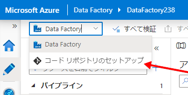
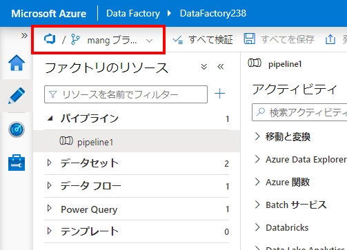
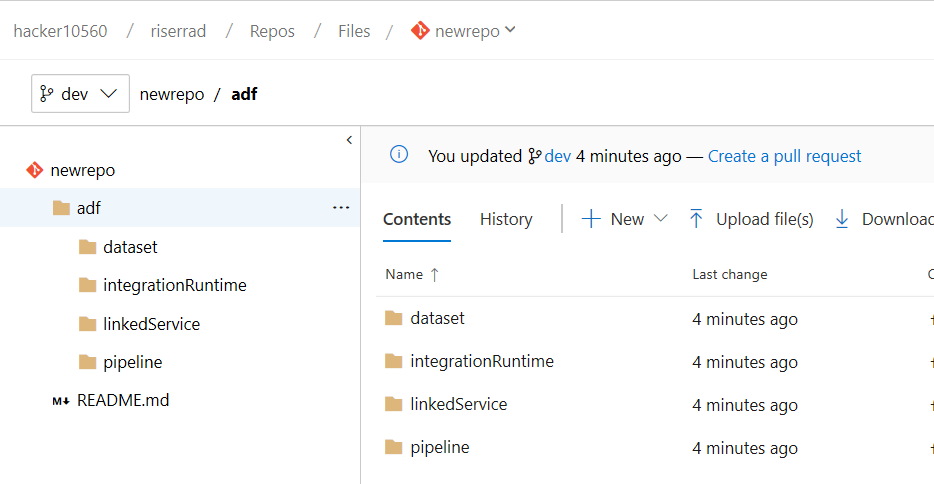

# 課題 03 - オンプレミスのソースからデータを抽出する

この課題の目標は次の点です。

- 2 つのオンプレミス ソースからデータを抽出します。
    - CSV データ ソース
    - SQL Server データベース
- すべてを設定した後、ソース管理を設定します

## 2 つのオンプレミス ソースからデータを抽出する

CSV と SQL データベースの両方が *onprem* 仮想マシンでホストされます。これらの仮想マシンは、OpenHack の目的では、すべて Azure 仮想マシンです。

Azure Data Factory を介してオンプレミス ソースからデータを抽出できるようにするには、[セルフホステッド Integration Runtime](https://docs.microsoft.com/ja-jp/azure/data-factory/create-self-hosted-integration-runtime) を活用する必要があります。

> *統合ランタイム (IR) は、異なるネットワーク環境間でデータ統合機能を提供するために Azure Data Factory によって使用されるコンピューティング インフラストラクチャです。*

そのため、オンプレミス ソースからクラウドにデータをコピーするために実行する必要がある基本的な手順は次のとおりです。

- [ソースのセルフホステッド Integration Runtime を作成する](challenge-03/creating-self-hosted-ir.md)
    - この課題に必要な Integration Runtime ごとに、この手順を繰り返す必要があります (ファイル システムおよびオンプレミス SQL Server)
    - オンプレミスの仮想マシンに IR をインストールして構成する
- この Integration Runtime を使用するリンク サービスを作成する
    - [ファイル システムのリンク サービス](challenge-03/creating-file-system-linked-service.md)
    - [オンプレミス SQL Server のリンク サービス](challenge-03/creating-onprem-sql-server-linked-service.md)
- データセットを作成する
    - [ファイル システム ソース用のデータセット](challenge-03/creating-file-system-dataset.md)
        - このファイル システムのシンク データセットの場合、オンプレミスのマシンには、Parquet ファイルを生成するために必要な [要件](https://docs.microsoft.com/ja-jp/azure/data-factory/supported-file-formats-and-compression-codecs#parquet-format)がない場合があるため、 **[バイナリ データセット](challenge-03/creating-sink-binary-dataset.md)** を作成してファイルを *そのまま* コピーできます。
    - [オンプレミス SQL Server のデータセット](challenge-03/creating-onprem-sql-server-dataset.md)
        - このオンプレミス SQL Server のシンク データセットには、Movies カタログをコピーするために作成した **JSON** シンク データセットを使用できます。 これは、オンプレミスのマシンに Parquet ファイルを生成するために必要な[要件]([requirements](https://docs.microsoft.com/ja-jp/azure/data-factory/supported-file-formats-and-compression-codecs#parquet-format))がない可能性があるためです。
- パイプラインを作成する
    - [オンプレミス SQL Server のパイプライン](challenge-03/creating-onprem-sql-server-pipeline.md)
    - [ファイル システム ソース用のパイプライン](challenge-03/creating-file-system-pipeline.md)

## ソース管理の確立

Azure Data Factory は、UI からの Git 統合をサポートしています。 この統合では、GitHub または Azure DevOps のいずれかがサポートされます。

### Azure DevOps 統合の設定

> チーム プロジェクト/リポジトリを使用する権限が割り当てられたばかりの場合は、この統合を構成する前に、Web UI から少なくとも 1 回アクセスし、条件に同意したことを確認してください。

- Azure DevOps アカウントに移動し、新しいチーム プロジェクトまたは既存のチーム プロジェクト内に新しいリポジトリを作成します。
- `.gitignore` または `README.me` ファイルを使用して、この新しいリポジトリを初期化します。
- このリポジトリの複製 URL を取得し、Azure Data Factory に戻ります。
    - たとえば、`https://johndoe@dev.azure.com/myazdoinstance/myteamproject/_git/myrepository` などです。ここで、
        - `johndoe` はユーザー名です
        - `myazdoinstance` は Azure DevOps 組織名です
        - `myteamproject` はチーム プロジェクト名です
        - `myrepository` はリポジトリ名です
    - Azure DevOps UI から URL を取得すると、この URL の準備が整います
- Azure Data Factory に戻り、左上のドロップダウン ボタンで `Set up Code Repository` を選択します

- 右側に表示される **[リポジトリの設定]** ボックス:

1. [`Azure DevOps`] を選択します
2. `Azure DevOps account` を選択します
3. `Team Project` を選択します
4. **新規** または **既存** の Git リポジトリのいずれを使用するか選択します
5. `Collaboration branch` を選択します
    - **コラボレーション ブランチは**、オブジェクトの発行元となるブランチを Data Factory に知らせる場合に便利です。 オブジェクトを他のブランチに保存している場合、そのブランチは使用しません。
6. Data Factory オブジェクトのすべてのコードが保存される `Root folder` を Git リポジトリ内に設定します
7. 既に Data Factory オブジェクト (リンク サービス、データセットなど) が構成されているため、それらのコードをソース管理にインポートすることをお勧めします。
これを行うには、 `Import existing Data Factory resources to repository` を選択します。
    - `Branch to import resources into` で、次のいずれかを選択します
        - `Collaboration` ブランチに直接インポートする
        - ブランチを `Create new` してインポートする (推奨)
            - 新しいものを作成する場合は、必ず名前を付けてください
        - `Use existing` 実行するためのブランチが既にある場合

保存すると、どのブランチを使用するかを尋ねられます。
作成したばかりのブランチを選択して、動作を確認します。

Azure DevOps に切り替えた場合、`master` ブランチは変更されていないままです。

ただし、作成したブランチ (このガイダンスの目的では、`dev` ブランチ) では、`/adf` ディレクトリの下にすべてのファイルが表示されています。

## ラーニング エクスペリエンスと道路ブロック

## 潜在的なフィードバック

- Azure Cloud Shell でファイル エディターを使用するたびに、コマンド ラインの動作が停止します。 ページ全体をリロードして、再び機能させる必要があります。
欠点は、変数値を設定した場合、それが失われることです。
- DataFactory の PowerShell コマンドラインには `-Validate` 修飾子を付けることができるため、リンク サービス/データセット/パイプライン ファイルを DataFactory で作成する前に検証できます。
    - 現在、これを行う唯一の方法は、作成のために送信することです。失敗した場合は、適切なエラー メッセージが表示されますが、成功した場合は、Data Factory にリソースが作成されます。 検証のみを行いたいが、まだ作成していない場合はどうしたらよいか
- セルフホステッド IR が構成されたマシンが既にあり、別の IR に接続するように再構成したい場合は、ガイド用のドキュメントはありません。 そのため、次の問題を作成しました。
    - [セルフホステッド IR のインストールを再構成する方法を説明する必要があります](https://github.com/MicrosoftDocs/azure-docs/issues/29819)
- Data Factory は、自動的に生成する JSON ファイルに資格情報を `encryptedCredential` として保存します。 生の資格情報を使用してファイルを作成し、Data Factory が変換を実行するのではなく、JSON ファイルを使用してデータセットを作成するユーザーがデータセットを正しく保存できるように、データセットの生成方法を教えるドキュメントがあればよいでしょう。
- Az モジュールと Data Factory V2 の機能に関しては、リソースに名前を付ける方法にパターンが必要です。
    - リンク サービスを作成する場合は、ダッシュ (`-`) を使用できます
    - データセットを作成する場合は、アンダースコア (`_`) のみを使用できます
    - セルフホステッド統合ランタイム作成する場合は、ダッシュ (`-`) のみを使用できます (`^[A-Za-z0-9]+(?:-[A-Za-z0-9]+)*$`)
- ADF でコード リポジトリを構成するときに、`Azure DevOps` を選択して組織の読み込みを開始すると、ページの再読み込みループで点滅し始めることがあります。 その後は、Data Factory にアクセスできなくなります。

### セルフホステッド IR

- ファイル システム IR のリンク サービスを作成する場合、プロパティの 1 つが `properties:typeProperties:host` になります。 一見、マシンのホスト名のように見えますが、実際には共有したいフォルダーです。
このプロパティの名前を変更できると便利です。