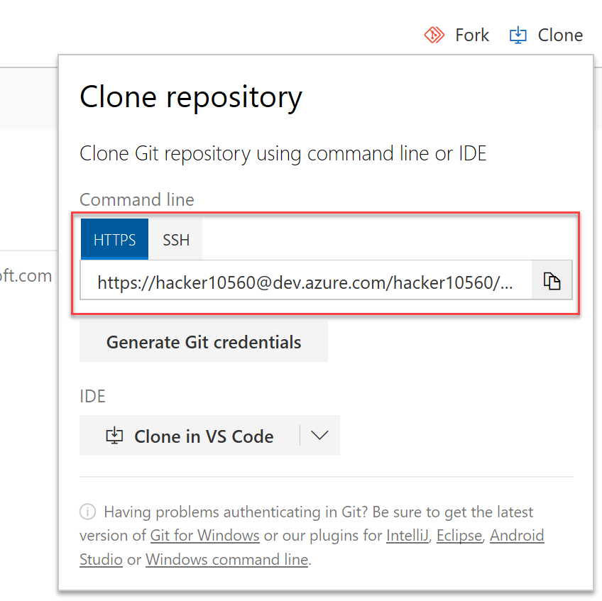
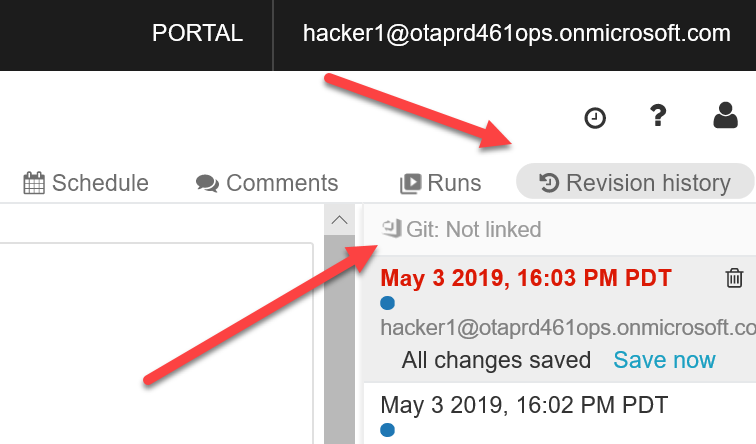
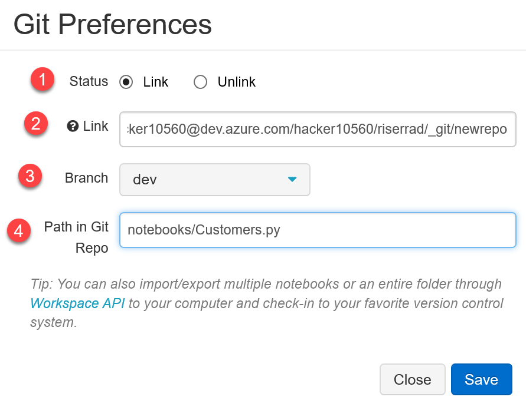
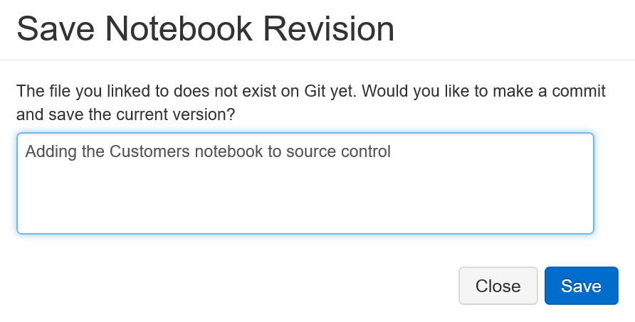

# ソース管理への Databricks ノートブックの追加

Azure DevOps Git リポジトリでブランチ ポリシーを構成したら、それを使用して、作成した各ノートブックのバージョン管理を行います。 これを行うには、[このリファレンス](https://docs.azuredatabricks.net/user-guide/notebooks/azure-devops-services-version-control.html)に従って、各ノートブックを開発ブランチのリポジトリ サブフォルダー (`/notebooks` など) に追加します。

- Azure DevOps のリポジトリ ビューで、画面の右上にある `Clone` ボタンをクリックします。 次のような結果が表示されます。

- Databricks に戻り、ソース管理に追加する Notebook を開きます。
- ページの右上の `Revision history` をクリックします

- [`Git: Not linked] (Git: リンクされていない) をクリックします

- この新しい画面で、次のようにします。
    1. [`Link`] を選択します
    2. Azure DevOps から取得した Git クローン URL を貼り付けます
    3. 以前に作成した `dev` ブランチを選択します。 選択できない場合は、「`dev`」と入力して `Create new dev branch` をクリックします
    4. 提案された `Path in Git repo` を `notebooks/<notebook name>.py` のようなものに簡略化する
    5. [`Save`] をクリックします。

これらの手順を実行すると、コミットのコメントを求めるメッセージが表示されます。
これを行い、`Save` をクリックします。

ノートブックに対して行った変更をコミットする場合は、毎回 `Revision history` をクリックし、一覧の最新の更新プログラムで `Save now` をクリックします。